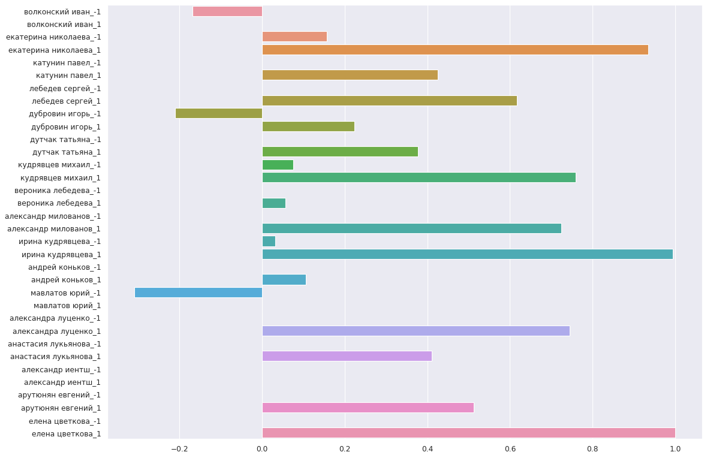
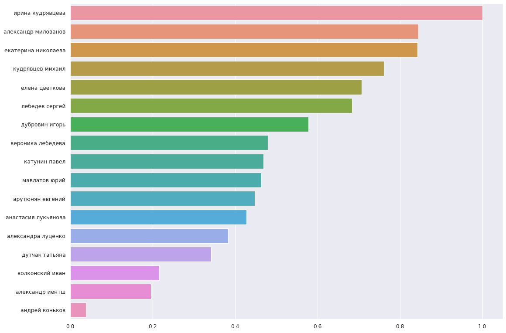
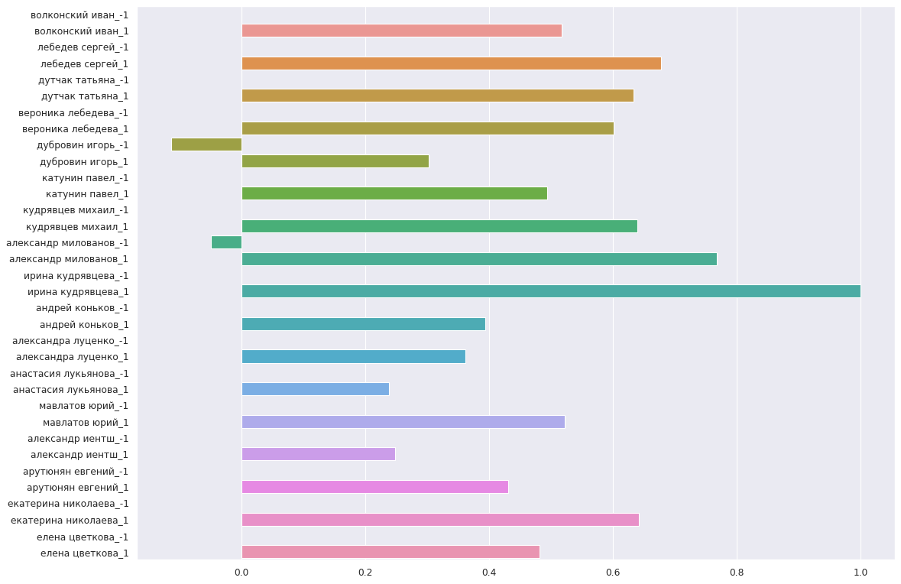
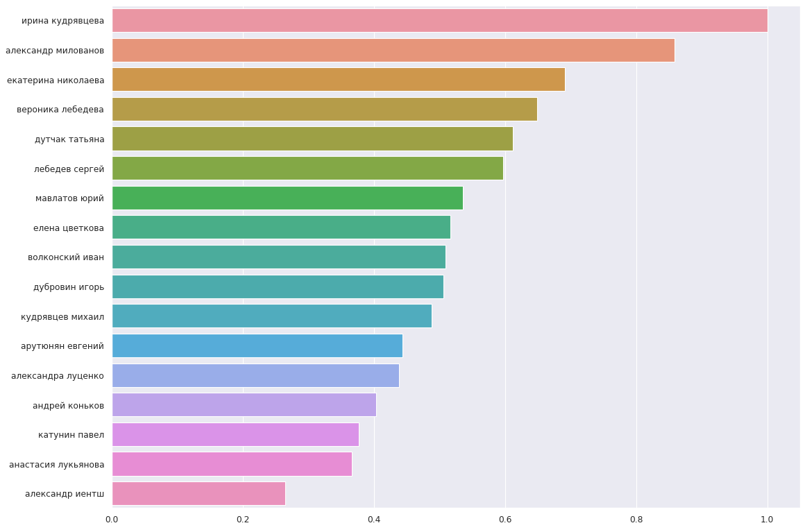

# Анализ влияния крестов на занимаемое в конкурсе место

В рамках данной работы проводится анализ того, как кресты того или иного судьи влияют на итоговое занимаемое в конкурсе место.

**Данная работа не претендует на звание истины в последней инстанции и является исключительно образовательным экспериментом.**

Поэтому не надо кидать в меня (Клювин Артем, очень приятно познакомиться) помидорами при встрече :) Фидбек и пулл-реквесты приветствуются.

Ну что ж, начнем.

## Постановка задачи

Во всех раундах, кроме финального (данные из финалов в этой работе в расчет не берутся) оценка судьи в хастле является бинарной: `хочу/не_хочу, 
чтобы данный спортсмен прошел в следующий раунд`. При этом в силу того, что судьи являются разными людьми, критерии их оценивания спортсменов отличаются друг от друга.
В связи с этим может возникнуть классическая ситуация `судья Х меня постоянно крестит, но при этом я дальше четвертьфинала не прохожу`. 

Таким образом, если ориентироваться исключительно на мнение какого-то одного судьи, и добиться своим танцем полного его расположения, итоговая позиция в турнире
может даже ухудшиться, так как в глазах других судей вы можете деградировать (например, потому, что последний месяц тренировали только музыкальность и забили на бэйсик).

В данной работе ставится задача поиска зависимости между позицией в турнире и тем, насколько активно тот или иной судья крестит/не_крестит спортсменов. 
А также проводится интегральная оценка веса креста судьи. Приближенно данная интегральная оценка может быть интерпретирована следующим образом: 
чем выше она у судьи, тем сильнее его мнение о спортсмене влияет на итоговую позицию спортсмена на турнире.

## Используемые данные

При анализе использовались результаты JnJ номинаций следующих турниров (источник - [форум АСХ](http://hustle-sa.ru/forum/index.php)): 
- NORD CUP 2020_2020-03-13
- Rock'n'Dance CUP 2020_2020-03-22
- Free your mind_2020-07-04
- Кубок Лета_2020-08-08
- SIBERIAN JAM_2020-09-19
- Открытие Сезона 2020-2021, г. Москва_2020-09-27
- MusicUp_2020-10-03
- Чемпионат Екатеринбурга 2020_2020-10-03
- H&D Cup_2020-10-16
- Осенний кубок клуба "Движение"_2020-10-31
- Чемпионат Казани_2020-11-07
- SNEG-i-RHYTHM_2020-12-06
- ЭТО НЕ ЧР 2020_2020-12-12
- Jack and Jill Оnly"_2021-01-23

Полученные данные были подвергнуты следующей фильтрации:
- Были удалены данные обо всех спортсменах, о которых в датасете было менее, чем 10 оценок от всех судей.
- Были удалены данные об оценках всех судей, поставивших менее 500 крестов во всем датасете.

Обучение проводилось дважды: первый раз - на полном датасете, во второй раз - на урезанном датасете, который был получен отбором 500 случайных оценок
каждого судьи (судьи с меньшим количеством оценок во втором анализе не участвовали).

Размер полного датасета составил 33431 точки.

Размер усеченного датасета составил 8500 точек.

## Условные обозначения

Под положительной оценкой судьи ниже подразумевается наличие креста, если судья судил спортсмена, а под отрицательной - отсутствие креста в тех же условиях.

Сумма положительных оценок от судьи `i` выданных спортсмену за одну номинацию далее обозначается как `S_i+`. 

Аналогичная сумма отрицательных оценок далее обозначается как `S_i-`.

Суммарное количество участников в номинации далее обозначается как `total_competitors`.

## Построение модели

На основе извлеченных данных были построены 2 линейные модели (использовалась линейная модель с регуляризатором [Lasso](https://scikit-learn.org/stable/modules/linear_model.html#lasso)), 
предсказывающие место спортсмена на турнире, исходя из того, сколько положительных и сколько отрицательных оценок поставил спортсмену тот или иной судья. 

Первая модель на вход принимала данные в форме

| `S_1+` | `S_1-` | `S_2+` | `S_2-` | ... | `total_competitors` |
|---|---|---|---|---|---|
|3|0|1|2|...|10|

Вторая (упрощенная) модель работала только с разностями суммарного количества положительных и отрицательных оценок судей за номинацию. То есть данные подавались в виде:
| `S_1+ - S_1-` | `S_2+ - S_2-` | ... | `total_competitors` |
|---|---|---|---|
|3|-1|...|10|

В первом случае в качестве веса оценки судьи рассматривался весовой коэффициент модели перед фактором положительной или отрицательной оценки судьи.

В качестве интегральной оценки веса креста судьи рассматривался весовой коэффициент второй модели перед фактором разности оценок судьи.

Данные модели были обучены кросс-валидацией на 5 фолдах с тестовой выборкой в 10% от общего датасета. 

## Оценка адекватности

В качестве критерия адекватности построенных моделей использовался [коффициент детерминации](https://scikit-learn.org/stable/modules/generated/sklearn.metrics.r2_score.html).

На 10% отложенной выборке были показаны следующие результаты:
| | модель 1 | модель 2 |
|---|---|---|
| Полный датасет | 0.79 | 0.70 |
| Урезанный датасет | 0.53 | 0.53 |

Можно заметить существенное уменьшение предсказательной точности обеих моделей на урезанном датасете. Вероятные причины следующие:
- Недостаточный размер выборки
- Неполнота данных о результатах выступления

Вторая причина представляется более важной, так как в случае урезанного датасета модель не имеет знания о всех оценках судьей спортсмена на турнире
(поскольку оценки были отобраны случайным образом). Тем не менее, как будет показано ниже, относительное распределение весов модели на урезанном датасете сохраняет 
существенные сходства с аналогичным распределение модели на полном датасете.

## Интерпретация результатов

Ниже показано распределение весов перед оценками судей, полученных двумя моделями на двух датасетах.

**Модель 1, полный датасет**

**Модель 2, полный датасет**

**Модель 1, урезанный датасет**

**Модель 2, урезанный датасет**

Для удобства анализа все веса нормированы на единицу.

Как можно заметить, тройка судей с наибольшим интегральным весом креста остается неизменной как при обучении на полном, так и на урезанном датасете,
что косвенным образом свидетельствует об "уверенности модели в значимости этих факторов".

## Что можно попробовать улучшить

- В данной работе обучение модели проводилось сразу на всех JnJ-категориях. В будущем будет интересно посмотреть на то, как изменяются результаты
при обучении, например, только на бегиннерах или только на партнершах.
- Стоит попробовать более продвинутые модели, такие как RandomForest.
- Собрать данные за более ранние периоды (в 2020 году изменился формат данных для JnJ, и свой парсер я заточил на него).
- Посчитать разные критерии статистической значимости предсказаний модели.

**Всем, кто дочитал до сюда и не уснул, огромное спасибо за внимание :)**
